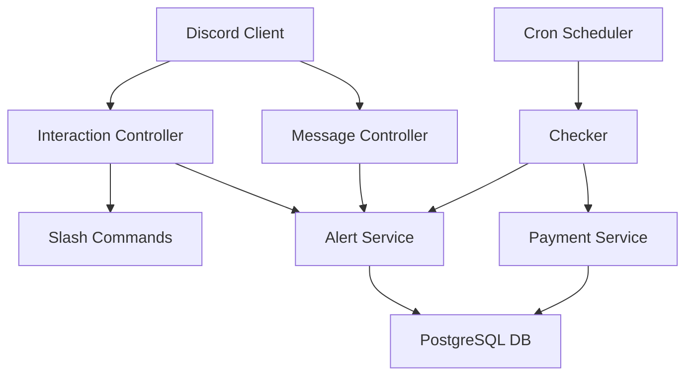

# 💳 Payout Notify Bot

A production-ready Discord bot built with **Bun**, **TypeScript**, and **PostgreSQL** to manage recurring payments and ensure you never miss a due date.

---

## ✨ Features

- 🚀 **Automated Alerts**: Intelligent daily checks for upcoming payments.
- ✅ **One-Click Acknowledgement**: Simply reply `ack` or `acknowledged` to an alert message.
- 🛠️ **Slash Commands**: Full management suite (`/check`, `/add`, `/update`, `/delete`).
- 🌊 **Real-time Synchronization**: Powered by Discord's Gateway (WebSockets).
- 🗄️ **Robust Persistence**: Relationally structured PostgreSQL storage with atomic operations.
- 🐳 **Docker Optimized**: Multi-stage builds and container-ready configuration.

---

## 🏗️ Architecture



---

## 🛠️ Installation & Setup

### 1. Discord Developer Portal Setup

1. Create a new application at [Discord Developers](https://discord.com/developers/applications).
2. Under **Bot**, enable **Message Content Intent**.
3. Generate an Invite URL via **OAuth2 URL Generator** with scopes: `bot`, `applications.commands`.
4. Required permissions: `Send Messages`, `Add Reactions`, `Embed Links`, `Manage Messages`.

### 2. Environment Configuration

Create a `.env` file in the root directory:

```env
# Discord
DISCORD_BOT_TOKEN="your_bot_token"
DISCORD_APPLICATION_ID="your_app_id"
DISCORD_CHANNEL_ID="target_channel_id"
DISCORD_GUILD_ID="your_guild_id"   # Optional — omit for global command registration

# Database
POSTGRES_USER=bot
POSTGRES_PASSWORD=bot
POSTGRES_DB=payouts

# Application
ALERT_DAYS_BEFORE=3
CRON_SCHEDULE="0 9 * * *"
APP_TIMEZONE="UTC"                 # Any IANA timezone e.g. Asia/Kolkata, America/New_York

# DB pool tuning (optional)
DB_POOL_MAX=10
DB_IDLE_TIMEOUT=20
DB_CONNECT_TIMEOUT=10
```

### 3. Deployment

#### Using Docker (Recommended)

```bash
docker compose up -d
```

#### Running Locally

Ensure you have [Bun](https://bun.sh) installed:

```bash
bun install
bun run src/index.ts
```

---

## 🎮 Slash Commands

| Command   | Description                                         |
| :-------- | :-------------------------------------------------- |
| `/check`  | View all payments due this month with their status. |
| `/add`    | Register a new recurring payment.                   |
| `/update` | Modify details of an existing payment.              |
| `/delete` | Remove a payment from the registry.                 |

---

## 🧪 Development & Testing

```bash
# Run all tests
bun test

# Run a specific test file
bun test tests/dates.test.ts

# Format code
bun run format
```
